# 🏗️ Matrix Helicopter Architecture

This document provides a comprehensive overview of the Matrix Helicopter project architecture, designed for developers who want to understand the system design and contribute effectively.

## 🎯 Design Philosophy

### Core Principles
- **Contemplative Computing**: Technology that serves mindfulness and reflection
- **Emergent Complexity**: Simple components combining to create rich experiences
- **Performance Mindfulness**: Optimization that doesn't compromise contemplative quality
- **Accessible Transcendence**: Advanced concepts made approachable through design

### Architectural Values
- **Modularity**: Independent systems that work together harmoniously
- **Testability**: Comprehensive testing for reliable meditation experiences
- **Extensibility**: Easy addition of new philosophical concepts and zones
- **Maintainability**: Clean code that future contemplators can understand

## 🌐 System Overview


## 📁 Project Structure

### Source Code Organization

```
src/
├── helicopter/              # Flight mechanics and customization
│   ├── HelicopterController.js    # Core flight physics and controls
│   └── HelicopterCustomization.js # Visual themes and progression
├── environment/             # World systems and atmospheric effects
│   ├── DayNightCycle.js          # Time-based lighting and phases
│   └── WeatherSystem.js          # Procedural weather and particles
├── audio/                   # Sound design and spatial audio
│   └── AudioManager.js           # 3D audio and procedural soundscapes
├── systems/                 # Game logic and progression
│   └── AchievementSystem.js      # Contemplative milestones and unlocks
└── index.js                 # Application entry point and initialization
```

### Test Infrastructure

```
tests/
├── helicopter/              # Flight system testing
│   ├── HelicopterController.test.js (88 tests)
│   └── HelicopterCustomization.test.js (73 tests)
├── environment/             # Environmental system testing
│   ├── DayNightCycle.test.js (50 tests)
│   └── WeatherSystem.test.js (67 tests)
├── audio/                   # Audio system testing
│   └── AudioManager.test.js (71 tests)
├── systems/                 # Achievement and progression testing
│   └── AchievementSystem.test.js (88 tests)
├── integration/             # Cross-system integration testing
│   └── GameIntegration.test.js (82 tests)
├── __mocks__/              # Testing infrastructure and mocks
│   ├── three.js                  # Complete Three.js API mocking
│   └── cannon-es.js              # Physics engine mocking
└── setup.js                # Test environment configuration
```

### Configuration and Build

```
.github/
├── workflows/               # CI/CD automation
│   ├── test.yml                  # Automated testing on push/PR
│   └── release.yml               # Release and deployment automation
├── ISSUE_TEMPLATE/          # GitHub issue templates
└── PULL_REQUEST_TEMPLATE.md # PR template for contributors

docker/
├── Dockerfile               # Test environment containerization
└── docker-compose.yml      # Service orchestration
```

## 🚁 Core Systems

### Helicopter Controller (`src/helicopter/HelicopterController.js`)

**Responsibility**: Realistic helicopter physics and flight controls

**Key Components**:
- **Flight Dynamics**: Mass, lift, drag, gravity simulation
- **Control Processing**: Collective, cyclic, and pedal input handling
- **Physics Integration**: Real-time velocity and position updates
- **Visual Synchronization**: Rotor animation and effect systems

**Design Patterns**:
- **Component Pattern**: Separate physics, visual, and control concerns
- **Observer Pattern**: Camera and effects respond to helicopter state
- **Strategy Pattern**: Different flight modes (normal, meditation, hover)

```javascript
class HelicopterController {
  constructor(scene, camera) {
    this.initializePhysics();     // Mass, forces, constraints
    this.createVisualComponents(); // 3D models, rotors, effects
    this.setupCamera();           // Third-person following system
  }
  
  update(deltaTime, controls) {
    this.processControls(controls, deltaTime);  // Input → forces
    this.updatePhysics(deltaTime);             // Forces → motion
    this.updateVisuals(deltaTime);             // Motion → graphics
    this.updateCamera();                       // Graphics → view
  }
}
```

**Performance Considerations**:
- **60 FPS Target**: Optimized physics calculations
- **Memory Management**: Proper object disposal for long sessions
- **Smooth Interpolation**: Consistent visual updates regardless of framerate

### Environment Systems (`src/environment/`)

#### Day/Night Cycle (`DayNightCycle.js`)

**Responsibility**: Time-based atmospheric changes and Matrix-inspired transitions

**Key Features**:
- **Matrix Time Phases**: Digital dawn, code noon, virtual evening, digital night
- **Dynamic Lighting**: Sun positioning, intensity, and color temperature
- **Shader Integration**: Real-time sky rendering with procedural effects
- **Meditation Sync**: Time flow responds to contemplative states

**Technical Implementation**:
```javascript
class DayNightCycle {
  constructor(scene) {
    this.createMatrixSky();      // Procedural sky shader
    this.createDigitalSun();     // Dynamic light source
    this.defineTimePhases();     // Philosophical time periods
  }
  
  update(deltaTime) {
    this.updateTime(deltaTime);           // Progress through day
    this.updateLighting();               // Adjust sun and ambient
    this.updateShaderUniforms();         // Pass time to shaders
    this.updateAtmosphericEffects();     // Fog, particles, transitions
  }
}
```

#### Weather System (`WeatherSystem.js`)

**Responsibility**: Procedural weather effects and atmospheric immersion

**Weather Types**:
- **Digital Rain**: Matrix-style cascading code particles
- **Code Snow**: Falling alphanumeric characters
- **Data Storms**: Intense computational weather patterns
- **Clear Skies**: Peaceful, contemplative conditions

**Performance Architecture**:
- **Object Pooling**: Reuse particles for memory efficiency
- **Level of Detail**: Reduce complexity at distance
- **Frustum Culling**: Only render visible weather effects
- **Adaptive Quality**: Scale effects based on performance

### Audio Manager (`src/audio/AudioManager.js`)

**Responsibility**: Immersive 3D audio and procedural soundscapes

**Audio Categories**:
- **Helicopter Sounds**: Engine, rotor, wind interaction
- **Environmental Audio**: Zone ambience, weather sounds
- **Philosophical Narration**: Guided meditation and insights
- **UI Feedback**: Subtle interface audio cues

**3D Audio Features**:
```javascript
class AudioManager {
  constructor(camera, helicopter) {
    this.setupAudioListener(camera);     // 3D audio positioning
    this.createHelicopterAudio();        // Engine and rotor sounds
    this.initializeZoneAudio();          // Location-based audio
    this.setupProceduralAmbience();      // Dynamic soundscapes
  }
  
  updateAudio(helicopter, environment) {
    this.updateHelicopterAudio(helicopter); // RPM, pitch, volume
    this.updateEnvironmentalAudio(environment); // Weather, zone
    this.processContemplativeAudio();     // Meditation audio
  }
}
```

### Achievement System (`src/systems/AchievementSystem.js`)

**Responsibility**: Contemplative progression and philosophical milestones

**Achievement Categories**:
- **Flight Mastery**: Control precision and smoothness
- **Contemplative Depth**: Meditation zone engagement
- **Exploration Progress**: Discovery of philosophical areas
- **Insight Unlocks**: Understanding-based content gating

**Progression Mechanics**:
```javascript
class AchievementSystem {
  constructor() {
    this.initializeAchievements();       // Define milestone structure
    this.setupProgressTracking();        // Monitor contemplative metrics
    this.createUnlockSystem();           // Content gating logic
  }
  
  trackContemplation(location, duration, quality) {
    this.updateZoneProgress(location, duration);
    this.calculateInsightLevel(quality);
    this.checkAchievementTriggers();
    this.unlockNewContent();
  }
}
```

## 🧪 Testing Architecture

### Test Strategy

**Test Pyramid**:
1. **Unit Tests (70%)**: Individual component testing
2. **Integration Tests (25%)**: Cross-system interactions
3. **End-to-End Tests (5%)**: Complete user journey validation

**Test Categories**:
- **Physics Tests**: Flight mechanics accuracy and stability
- **Philosophy Tests**: Meditation and achievement logic
- **Performance Tests**: 60 FPS maintenance under load
- **Accessibility Tests**: Inclusive design validation

### Docker Test Environment

**Containerization Benefits**:
- **Consistency**: Same environment across development machines
- **Isolation**: Tests don't interfere with local development
- **Reproducibility**: Exact same conditions for every test run
- **CI/CD Integration**: Seamless automation pipeline

```dockerfile
# Test environment optimized for Matrix Helicopter
FROM node:18-alpine
WORKDIR /app
ENV NODE_ENV=test
ENV CI=true

# Install dependencies and run comprehensive test suite
COPY package*.json ./
RUN npm ci
COPY . .
CMD ["npm", "run", "test:docker"]
```

### Mock Infrastructure

**Three.js Mocking**: Complete API coverage for 3D graphics testing
```javascript
// tests/__mocks__/three.js - Comprehensive Three.js API mocking
module.exports = {
  Vector3: mockVector3Constructor,
  Scene: mockSceneConstructor,
  PerspectiveCamera: mockCameraConstructor,
  WebGLRenderer: mockRendererConstructor,
  // ... 30+ additional mocked APIs
};
```

**Browser API Mocking**: Node.js compatibility for web APIs
```javascript
// tests/setup.js - Browser environment simulation
global.HTMLCanvasElement = mockCanvasElement;
global.AudioContext = mockAudioContext;
global.localStorage = mockLocalStorage;
global.requestAnimationFrame = mockRAF;
```

## 🔧 Build and Development

### Development Workflow

1. **Local Development**: Hot-reload development server
2. **Testing**: Continuous test execution with Docker
3. **Code Quality**: ESLint, Prettier, and type checking
4. **Performance**: Regular profiling and optimization

### Build Pipeline


### Performance Optimization

**Rendering Performance**:
- **Object Pooling**: Reuse expensive objects (particles, audio sources)
- **Frustum Culling**: Only render visible objects
- **Level of Detail**: Reduce complexity at distance
- **Batch Operations**: Group similar rendering calls

**Memory Management**:
- **Resource Disposal**: Proper cleanup of Three.js objects
- **Garbage Collection**: Minimize allocation in hot paths
- **Asset Optimization**: Compressed textures and efficient models
- **Memory Profiling**: Regular leak detection and optimization

## 🌊 Data Flow

### User Input → Simulation Response

```mermaid
sequenceDiagram
    participant U as User
    participant HC as HelicopterController
    participant E as Environment
    participant A as Audio
    participant AS as Achievements
    
    U->>HC: Control Input (W/A/S/D/Space/Shift)
    HC->>HC: Process Controls → Forces
    HC->>HC: Update Physics → Position/Rotation
    HC->>E: Position Change
    E->>E: Update Environmental Effects
    HC->>A: Flight State Change
    A->>A: Update 3D Audio
    HC->>AS: Flight Metrics
    AS->>AS: Track Progress → Unlock Content
```



### State Management

**Helicopter State**:
```javascript
const helicopterState = {
  position: Vector3,      // World coordinates
  velocity: Vector3,      // Current movement
  rotation: Euler,        // Orientation
  controls: {             // Input state
    collective: Float,    // 0-1 lift
    cyclicPitch: Float,   // -1 to 1 forward/back
    cyclicRoll: Float,    // -1 to 1 left/right
    pedal: Float          // -1 to 1 yaw
  },
  physics: {
    mass: 1000,           // kg
    lift: 15000,          // N max
    drag: 0.98            // coefficient
  }
};
```

**Environment State**:
```javascript
const environmentState = {
  time: 0.5,              // 0-1 normalized day time
  weather: 'digital_rain', // Current weather type
  phase: 'code_noon',     // Current time phase
  lighting: {
    sunIntensity: Float,
    ambientLevel: Float,
    colorTemperature: Color
  }
};
```

## 🔮 Extension Points

### Adding New Meditation Zones

1. **Philosophical Foundation**: Choose a contemplative concept
2. **Environmental Design**: Create the 3D space and atmosphere
3. **Interactive Elements**: Design subtle engagement mechanics
4. **Achievement Integration**: Connect to progression system
5. **Audio Design**: Compose zone-specific soundscapes

```javascript
class NewMeditationZone {
  constructor(scene, philosophicalConcept) {
    this.createEnvironment(scene);           // 3D space design
    this.setupPhilosophicalElements();       // Interactive concepts
    this.integrateLighting();                // Atmospheric effects
    this.configureAudio();                   // Zone-specific audio
    this.connectAchievements();              // Progress integration
  }
}
```

### Adding New Achievement Types

1. **Contemplative Metrics**: Define what to measure
2. **Progression Logic**: Create unlock conditions
3. **Visual Feedback**: Design subtle progress indicators
4. **Content Unlocks**: Connect to new zones or features

### Performance Monitoring

**Key Metrics**:
- **Frame Rate**: Maintain 60 FPS during meditation
- **Memory Usage**: Monitor heap growth during sessions
- **Render Calls**: Minimize draw calls for efficiency
- **Audio Latency**: Ensure responsive 3D audio positioning

## 🚀 Deployment Architecture

### GitHub Pages Deployment


### Release Process

1. **Version Tagging**: Semantic versioning (v1.0.0)
2. **Automated Testing**: Full test suite execution
3. **Build Optimization**: Production asset compilation
4. **GitHub Release**: Automated release notes and assets
5. **Pages Deployment**: Live demo update

---

This architecture document is living documentation that evolves with the project. For specific implementation details, refer to the source code and inline documentation.

*"The architecture itself must be contemplative - simple, clear, and serving the deeper purpose of digital mindfulness."*